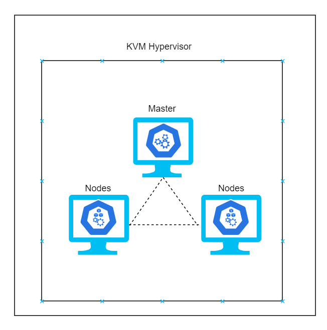

# Deploy Kubernetes cluster using Packer and Kickstart - Centos hands-on

>PLEASE NOTE: This is a work in progress. We will take some decisions to keep this a bit "hard" and "old school".

## Contents

<!-- TOC -->

- [Deploy Kubernetes cluster using Packer and Kickstart - Centos 7.x hands-on lab](#deploy-kubernetes-cluster-using-packer-and-kickstart---centos-7.x-hands-on-lab)
  - [Abstract and learning objectives](#abstract-and-learning-objectives)
  - [Overview](#overview)
  - [Solution architecture](#solution-architecture)
  - [Requirements](#requirements)
  - [Main task 1: Installing Packer](#installing-packer)
    - [Task 1: Setting up your local environment to run Packer](#setting-up-your-local-environment-to-run-packer)
    - [Task 2: xxxxx](#task-2-browsing-to-the-web-application)
    - [Task 3: xxxxx](#task-3-create-a-dockerfile)
  - [Main task 2: xx](#exercise-2-deploy-the-solution-to-azure-kubernetes-service)
    - [Task 1: xxxxx](#task-1-tunnel-into-the-azure-kubernetes-service-cluster)
    - [Task 2: xxxxx](#task-2-deploy-a-service-using-the-kubernetes-management-dashboard)
  - [Exercise 3: xxx](#exercise-3-scale-the-application-and-test-ha)
    - [Task 1: xxxxx](#task-1-increase-service-instances-from-the-kubernetes-dashboard)
  - [Exercise 4: xxx](#exercise-4-working-with-services-and-routing-application-traffic)
    - [Task 1: xxxxx](#task-1-scale-a-service-without-port-constraints)
    - [Task 2: Update an external service to support dynamic discovery with a load balancer](#task-2-update-an-external-service-to-support-dynamic-discovery-with-a-load-balancer)
    - [Task 3: xxxxx](#task-3-adjust-cpu-constraints-to-improve-scale)
  - [After the hands-on lab](#after-the-hands-on-lab)

<!-- /TOC -->

## Abstract and learning objectives

This hands-on lab is designed to guide you through the process of building and deploying a Kubernetes Cluster using Packer and KickStart. Also, how to work with remote log administration. This document is under development, and some commands and details are being added without a proper organization. Things like: commands for Kubernetes, KVM administration using *virsh* will be spread all around. (service scale-out, and high-availability, monitoring and trancing, will be the next project).

## Overview

Launch a Kubernetes cluster with three nodes, using CentOS. The logs have to be defined to rotate based on IO operations, and moved to a remote server. The condition to be moved need to respect low IO operations. In other words, if the IO operations are lower than 30% the rotate logs should be moved to a remote server. 

## Solution architecture

One host computer with a Linux distribution RedHat based distribution, to create 3 virtual machines each one will be a node of the Kubernetes cluster.
In this lab, I have used Fedora, and for the KVM guests are CentOS.



## Requirements

Let's simplify in *software* and *hardware* requirements.

- Software:

1. Packer <https://packer.io/downloads.html>
2. KVM <https://www.linux-kvm.org/page/Main_Page>
3. KickStart <https://access.redhat.com/documentation/en-us/red_hat_enterprise_linux/7/html/installation_guide/sect-kickstart-syntax>

Packer: file related *centos7-k8s-base.json*<br\>
KVM: file related *TODO* (shell script to launch the vms for testing)<br\>
KickStart: file related *c7-kvm-k8s.cfg*<br\>

- Hardware:

1. HD Free space around 15 giga: considering the three VMs that will host Master, the two K8s Nodes.
2. RAM around 8 Giga

## Installing Packer

From the hypervisor. Go to <https://releases.hashicorp.com/packer/>, find the latest release (some say this is the best practice).
Download it and unzip.

Example:

```sh
curl -LO https://releases.hashicorp.com/packer/1.5.5/packer_1.5.5_linux_amd64.zip
```

>Notice: Because the packer is already compiled, it is a good practice to verify if the file was perfectly downloaded.

Example:

```sh
curl -Os https://releases.hashicorp.com/packer/1.5.5/packer_1.5.5_SHA256SUMS
curl -Os https://releases.hashicorp.com/packer/1.5.5/packer_1.5.5_SHA256SUMS.sig
# This one below we don't need because we have downloaded it before
# curl -Os https://releases.hashicorp.com/packer/1.5.5/packer_1.5.5_linux_amd64.zip
# Verify the signature file is untampered.
# To create the hashicorp.asc go to <https://www.hashicorp.com/security.html>
# Get the "-----BEGIN PGP PUBLIC KEY BLOCK-----" until the "-----END PGP PUBLIC KEY BLOCK-----"
# clean the empty spaces and save the file as hashicorp.asc.
# Then import the file as follows:
```

Learn more at: <https://www.hashicorp.com/security/>

We can find the PGP like follows at the end of the page.


```sh
gpg --import hashicorp.asc
gpg --verify packer_1.5.5_SHA256SUMS.sig packer_1.5.5_SHA256SUMS
```

In case you get a Warning like follows. We are on the same boat.

```text
born # gpg --import hashicorp.asc
gpg: key 51852D87348FFC4C: public key "HashiCorp Security <security@hashicorp.com>" imported
gpg: Total number processed: 1
gpg:               imported: 1
born # gpg --verify packer_1.5.5_SHA256SUMS.sig packer_1.5.5_SHA256SUMS
gpg: Signature made Wed Mar 25 22:43:34 2020 GMT
gpg:                using RSA key 91A6E7F85D05C65630BEF18951852D87348FFC4C
gpg: Good signature from "HashiCorp Security <security@hashicorp.com>" [unknown]
gpg: WARNING: This key is not certified with a trusted signature!
gpg:          There is no indication that the signature belongs to the owner.
Primary key fingerprint: 91A6 E7F8 5D05 C656 30BE  F189 5185 2D87 348F FC4C
```

Take a look at:
<https://github.com/hashicorp/packer/issues/8745>

Verify the SHASUM matches the binary.

```sh
shasum -a 256 -c packer_1.5.5_SHA256SUMS
```

## Setting up your local environment to run Packer

After the download and verifications. We can the *packer binary*, to a proper location, like: */usr/local/bin*.

## Clone the repository

## Set your own variables

## Launch your KVM guest

## Commands and annotations

## My stuff bellow, I will delete it in the future and add somewhere else

## TODO

Setup the VM's configuration automatically.

1. Set the hostnames accordingly
2. Set up the K8s Master
3. Set up the log rotation <https://kubernetes.io/docs/concepts/cluster-administration/logging/>
4. Write a app to maintain the log transference based on the IO operations

Fix the index README.md
systemctl start docker
yum install -y kubelet kubeadm kubectl (Falhou no Kickstart?)
Kickstart missing ? (systemctl enable kubelet && systemctl start kubelet)
docker info | grep -i cgroup

kubeadm init --apiserver-advertise-address 192.168.100.170
kubeadm config images pull (beforehand e nao deixa passar nome só IP)

Depois:

  mkdir -p $HOME/.kube
  sudo cp -i /etc/kubernetes/admin.conf $HOME/.kube/config
  sudo chown $(id -u):$(id -g) $HOME/.kube/config

Tive que criar um user add ao docker group...

Push to master

When git completes, ssh-agent terminates, and the key is forgotten.

```sh
ssh-agent bash -c 'ssh-add ~/.ssh/packer-centos7-kvm-k8s; git push git@github.com:dev-sre-21/packer-centos-kvm-k8s.git'
```

Packer template:

>Values to notice: "disk_size": "10000", it is in mbytes.
It is around 10 gigabytes.

List and Shutdown guest VM KVM command line

```sh
sudo virsh list # it will show the guests running, to list all the guests add --all at the end
sudo virsh shutdown 11 --mode acpi
```

Getting the guest's IP address

*default* here is the network name

```sh
sudo virsh net-list # Get the network name
sudo virsh net-dhcp-leases default
```

Check the possible --os-variant OS

```sh
osinfo-query os | grep centos
```

Creating VM command line

After the image get done we have the results written at:

```text
The disk:
./centos7-k8s-base-img/centos7-k8s-base
```

And

```text
The downloaded ISO
./packer_cache/4643e65b1345d2b22536e5d371596b98120f4251.iso
```

So, to create the KVM guest we need to add this paths to the command line composition as follows:

> Notice: Plus the VM name.

```sh
# check if you have enough space
df -h . | tail -1 | awk '{print $4}'
echo "You should have at least 30G"
# lazyness: copying the main image to other vms
# keeping the orginal for future updates
sudo cp ./centos7-k8s-base-img/centos7-k8s-base ./centos7-k8s-kvm-imgs/centos7-k8s-base-1
sudo cp ./centos7-k8s-base-img/centos7-k8s-base ./centos7-k8s-kvm-imgs/centos7-k8s-base-2
sudo cp ./centos7-k8s-base-img/centos7-k8s-base ./centos7-k8s-kvm-imgs/centos7-k8s-base-3

USER=qemu
GROUP=qemu
sudo chown -R $USER:$GROUP /books/deployment/packer/kvm/packer-centos-kvm-k8s/centos7-k8s-kvm-imgs

VM="centos-kvm-k8s-01"
DISK="./centos7-k8s-kvm-imgs/centos7-k8s-base-1"
ISO="./packer_cache/4643e65b1345d2b22536e5d371596b98120f4251.iso"
sudo virt-install --import --name $VM --memory 2048 --vcpus 2 --cpu host --disk $DISK,format=qcow2,bus=virtio --disk $ISO,device=cdrom --network bridge=virbr0,model=virtio --os-type=linux --os-variant=centos7.0 --graphics spice --noautoconsole

# Changed the DISK variable to point to the copy of centos7-k8s-base
VM="centos-kvm-k8s-02"
DISK="./centos7-k8s-kvm-imgs/centos7-k8s-base-2"
ISO="./packer_cache/4643e65b1345d2b22536e5d371596b98120f4251.iso"
sudo virt-install --import --name $VM --memory 2048 --vcpus 2 --cpu host --disk $DISK,format=qcow2,bus=virtio --disk $ISO,device=cdrom --network bridge=virbr0,model=virtio --os-type=linux --os-variant=centos7.0 --graphics spice --noautoconsole

VM="centos-kvm-k8s-03"
DISK="./centos7-k8s-kvm-imgs/centos7-k8s-base-3"
ISO="./packer_cache/4643e65b1345d2b22536e5d371596b98120f4251.iso"
sudo virt-install --import --name $VM --memory 2048 --vcpus 2 --cpu host --disk $DISK,format=qcow2,bus=virtio --disk $ISO,device=cdrom --network bridge=virbr0,model=virtio --os-type=linux --os-variant=centos7.0 --graphics spice --noautoconsole
```

- References

- Push to master -  <https://help.github.com/en/github/authenticating-to-github/generating-a-new-ssh-key-and-adding-it-to-the-ssh-agent>
